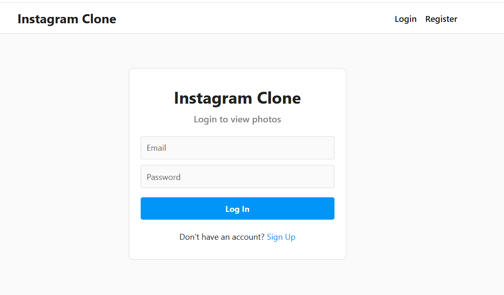
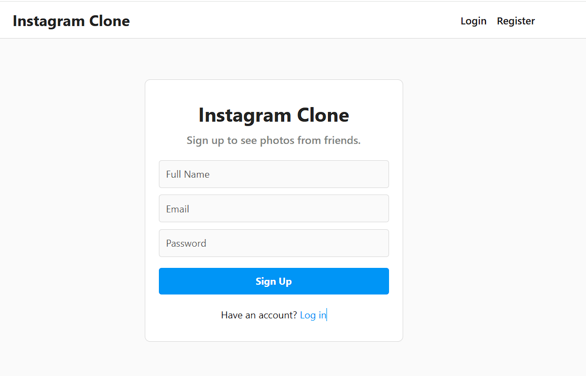
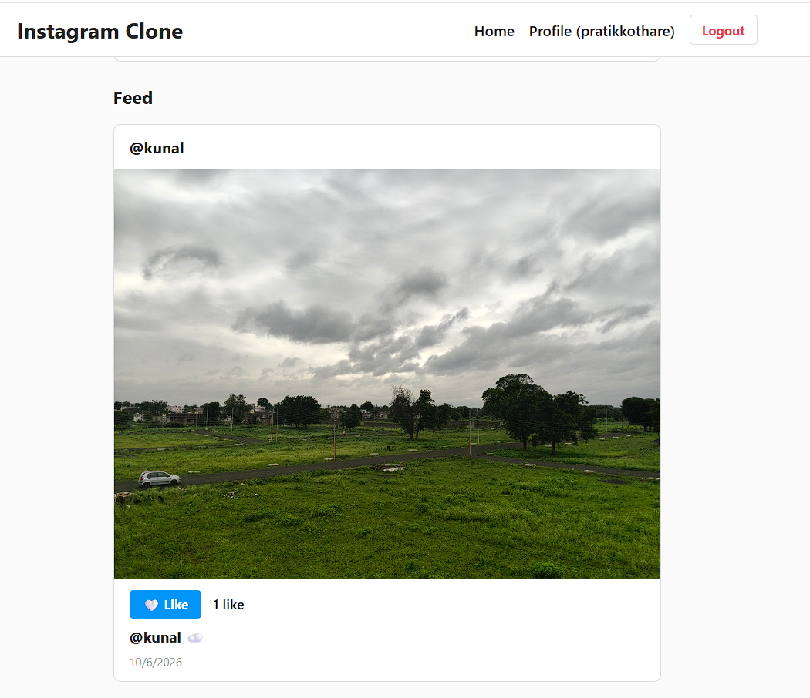
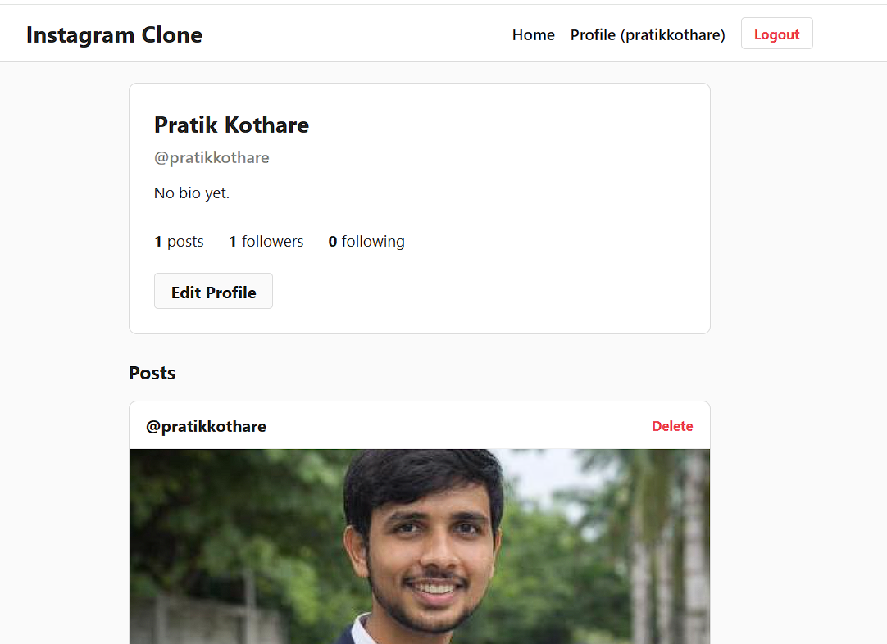
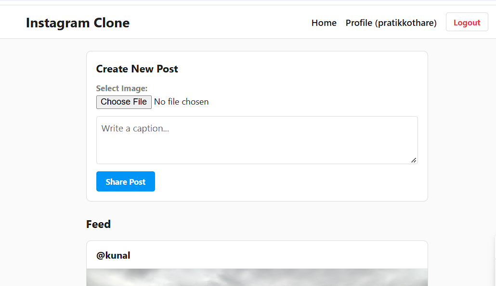

# 📸 Instagram Clone

A simple full-stack **Instagram Clone** built using the MERN stack.  
The project includes authentication, user profiles, posts, likes, follow/unfollow functionality, and image uploads using Cloudinary.

---

## 🚀 Live Demo

🔗 **Live Website:** [https://instagram-clone-f5rv.vercel.app/](https://instagram-clone-f5rv.vercel.app/)  
🔗 **GitHub Repository:** [https://github.com/PratikKothare123/InstagramClone](https://github.com/PratikKothare123/InstagramClone)

---

## ✨ Features

- 🔐 User Registration & Login
- 🔑 JWT-based Authentication
- 🔒 Protected Routes
- 👤 User Profile Management
- ✏️ Edit Username & Bio
- 👥 Follow / Unfollow System
- 📸 Create Image Posts
- 📝 Add Captions to Posts
- ❤️ Like / Unlike Posts
- 🗑️ Delete Own Posts
- ☁️ Cloudinary Image Upload
- 📊 Followers & Following Counts
- 📰 Home Feed with Latest Posts
- 📱 Responsive & Simple UI
- ⚡ Real-time Updates without Page Refresh

---

## 🛠️ Tech Stack

### Frontend
- React.js (Vite)
- React Router DOM
- Axios
- CSS3

### Backend
- Node.js
- Express.js
- MongoDB Atlas (Mongoose)
- JWT (jsonwebtoken)
- bcryptjs
- Multer
- Cloudinary API
- dotenv & CORS

### Deployment
- **Frontend**: Vercel
- **Backend**: Vercel (Serverless Functions)
- **Database**: MongoDB Atlas
- **Storage**: Cloudinary

---

## 📂 Project Structure

```text
InstagramClone/
├── backend/
│   ├── config/          # Database connection (db.js)
│   ├── controllers/     # Auth, User, and Post logic
│   ├── middleware/      # JWT protection & Multer upload
│   ├── models/          # User and Post Mongoose schemas
│   ├── routes/          # Express API route endpoints
│   ├── server.js        # Entry server file
│   └── vercel.json      # Serverless Vercel configuration
└── frontend/
    ├── src/
    │   ├── components/  # Navbar, PostCard, CreatePost, ProtectedRoute
    │   ├── context/     # AuthContext state
    │   ├── pages/       # Login, Register, Home, Profile, EditProfile
    │   └── services/    # Axios API client setup
    └── package.json
```

---

## 📸 Screenshots

### 🔐 Login Page
Users can securely log in using their registered email and password.  


---

### 📝 Registration Page
New users can create an account by providing their name, email, and password.  


---

### 📰 Home Feed
The home feed displays all posts with images, captions, like counts, and actions.  


---

### 👤 User Profile
Users can view profile details, follower/following counts, and user posts.  


---

### 📸 Create Post
Users can select an image file and add a caption to publish a post.  


---

## ⚡ Workflows

### 🔐 Authentication Flow
1. User enters credentials on Register/Login page.
2. Backend hashes password via `bcryptjs` and verifies credentials.
3. Express generates a signed **JWT token**.
4. Client stores token in `localStorage` and appends `Authorization: Bearer <token>` to protected API calls.

### 📸 Image Upload Flow
1. User selects an image file in the Create Post form.
2. Form submits `multipart/form-data` to Express.
3. **Multer** holds the file buffer in memory and streams it directly to **Cloudinary**.
4. Cloudinary returns a secure HTTPS URL which is stored in the MongoDB Atlas `Post` document.

---

## 🔌 API Endpoints Summary

### Authentication
- `POST /api/auth/register` - Create account
- `POST /api/auth/login` - Authenticate user
- `GET /api/auth/me` - Get logged-in user details

### User Profiles
- `GET /api/users/:username` - Get profile & user posts
- `PUT /api/users/profile` - Update username & bio
- `POST /api/users/:id/follow` - Follow user
- `DELETE /api/users/:id/follow` - Unfollow user

### Posts
- `GET /api/posts` - Fetch home feed posts
- `POST /api/posts` - Create post with Cloudinary upload
- `DELETE /api/posts/:id` - Delete owned post
- `POST /api/posts/:id/like` - Like post
- `DELETE /api/posts/:id/like` - Unlike post

---

## 🔒 Security Highlights

- Passwords hashed using **bcryptjs** before DB save.
- **JWT tokens** required for protected routes.
- Users can delete **only** their own posts.
- Users cannot follow themselves.
- Duplicate likes and duplicate follows are prevented at DB level using `$addToSet`.
- All API secrets stored safely in environment variables (`.env`).

---

## 🎯 Project Purpose

This project was developed for an internship assignment to demonstrate full-stack proficiency in building a clean MERN application with REST API design, authentication, cloud media storage, and SPA user experience.

---

## 👨‍💻 Author

**Pratik D. Kothare**  
Final Year B.Tech CSE  
*S.B. Jain Institute of Technology, Management & Research, Nagpur*

- **GitHub:** [github.com/PratikKothare123](https://github.com/PratikKothare123)  
- **LinkedIn:** [linkedin.com/in/pratik-kothare-99211628/](https://www.linkedin.com/in/pratik-kothare-99211628/)
